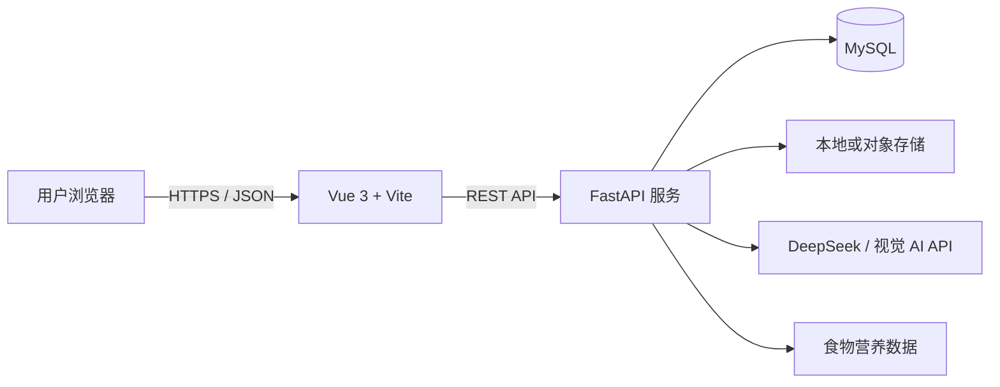

# 智能健康饮食助手 - 项目设计文档

## 1. 项目概述

智能健康饮食助手是面向个人用户的 Web 应用，帮助用户快速记录饮食、理解营养摄入情况，并根据近期记录获得个性化饮食建议。系统以结构化营养数据为基础，结合大语言模型完成自然语言建议生成；AI 输出仅作为健康生活方式参考，不替代医生、营养师的诊断或治疗意见。

### 1.1 建设目标

- 降低饮食记录成本：支持文字输入和图片上传两种记录方式。
- 将食物转化为可量化营养数据：记录热量、蛋白质、脂肪、碳水化合物等指标。
- 为用户提供可解释的趋势看板：查看日、周维度的摄入和目标完成情况。
- 基于用户资料、目标和近期记录生成针对性的饮食建议。
- 以容器化方式交付，支持一键启动前端、后端和 MySQL。

### 1.2 范围与边界

第一期聚焦单用户账户体系、食物记录、营养看板和 AI 建议。图片识别采用第三方视觉模型或多模态大模型接口，识别结果必须由用户确认后才能写入正式记录。系统不提供疾病诊断、处方、急救建议，也不承诺食物识别和营养估算的绝对准确性。

## 2. 用户与核心流程

### 2.1 目标用户

- 有减脂、增肌、维持体重等日常饮食管理需求的普通用户。
- 希望了解蛋白质、热量和三大营养素摄入情况的健身人群。

### 2.2 核心使用流程

1. 用户注册、登录并填写基础资料：年龄段、性别、身高、体重、活动水平和饮食目标。
2. 用户输入食物名称及份量，或上传餐食图片。
3. 后端查询食物营养库；图片场景先调用 AI 识别食物及估计份量，再返回候选项。
4. 用户确认或修改食物、份量和用餐时间后，系统保存饮食记录并计算营养摄入。
5. 前端从统计接口获取当天和近七天数据，使用 ECharts 展示趋势和目标完成度。
6. 用户主动请求饮食建议；后端汇总用户资料与近期统计，调用 DeepSeek API，保存建议摘要并返回页面。

## 3. 总体架构



### 3.1 技术选型

| 层级 | 技术 | 选择理由 |
| --- | --- | --- |
| 前端 | Vue 3、Vite、TypeScript、Axios、ECharts、Pinia | 开发效率高，适合构建响应式表单和数据看板。 |
| 后端 | Python 3.12、FastAPI、Pydantic、SQLAlchemy 2 | 异步接口能力、自动 OpenAPI 文档与严格请求校验。 |
| 数据库 | MySQL 8 | 关系模型清晰，适合用户、食物和记录等结构化数据。 |
| AI | DeepSeek API；可配置兼容 OpenAI 协议的视觉模型 | 文本建议成本可控，识别能力可按供应商替换。 |
| 文件存储 | 开发环境本地卷；生产环境 MinIO 或云对象存储 | 图片不直接存入 MySQL，便于扩展与清理。 |
| 容器 | Docker、Docker Compose、Nginx | 统一开发和部署环境，前端静态资源可由 Nginx 托管。 |

### 3.2 后端模块划分

- `auth`：注册、登录、JWT 鉴权、密码哈希。
- `users`：用户资料、营养目标计算和维护。
- `foods`：食品库检索、食品营养信息维护。
- `records`：饮食记录的新增、修改、删除和按日期查询。
- `recognition`：图片校验、存储、AI 调用和候选食物结构化解析。
- `analytics`：日/周聚合、目标完成率和趋势数据。
- `advice`：构建脱敏提示词、调用大模型、保存建议结果。

## 4. 数据库设计

所有表使用 `utf8mb4`、InnoDB 和 UTC 时间。主键建议使用 `BIGINT UNSIGNED`，金额和营养数值使用 `DECIMAL` 避免浮点累计误差。

### 4.1 核心实体

| 表名 | 用途 | 关键字段 |
| --- | --- | --- |
| `users` | 账户与基础资料 | `id`、`email`、`password_hash`、`nickname`、`gender`、`birth_date`、`height_cm`、`weight_kg`、`activity_level`、`goal_type` |
| `nutrition_targets` | 每日营养目标 | `user_id`、`calories_kcal`、`protein_g`、`fat_g`、`carbs_g`、`effective_date` |
| `foods` | 标准食物营养库 | `id`、`name`、`aliases`、`category`、`unit`、`kcal_per_100g`、`protein_per_100g`、`fat_per_100g`、`carbs_per_100g` |
| `meal_records` | 用户的一次食物摄入 | `id`、`user_id`、`food_id`、`food_name_snapshot`、`meal_type`、`consumed_at`、`amount_g`、`source_type`、`image_url` |
| `meal_record_nutrition` | 记录创建时的营养快照 | `meal_record_id`、`calories_kcal`、`protein_g`、`fat_g`、`carbs_g` |
| `image_recognition_jobs` | 图片识别任务及候选结果 | `id`、`user_id`、`image_url`、`status`、`provider`、`raw_response`、`result_json`、`error_message` |
| `ai_advice_logs` | AI 建议审计与历史 | `id`、`user_id`、`period_start`、`period_end`、`input_summary_json`、`advice_text`、`model`、`status` |

### 4.2 关系与索引

- `users` 1:N `meal_records`、`nutrition_targets`、`image_recognition_jobs`、`ai_advice_logs`。
- `foods` 1:N `meal_records`；记录保留 `food_name_snapshot` 和营养快照，避免食品库修改后污染历史数据。
- 为 `meal_records(user_id, consumed_at)` 创建联合索引，支撑日/周查询。
- 为 `foods(name)` 和可选的全文索引 `aliases` 创建检索索引。
- `image_recognition_jobs(user_id, created_at)`、`ai_advice_logs(user_id, created_at)` 创建联合索引。

## 5. REST API 设计

API 前缀为 `/api/v1`，响应统一格式：`{ "code": 0, "message": "ok", "data": {} }`。认证接口外，其余接口均携带 `Authorization: Bearer <JWT>`。

| 方法 | 路径 | 说明 |
| --- | --- | --- |
| POST | `/auth/register` | 注册用户。 |
| POST | `/auth/login` | 登录并返回访问令牌。 |
| GET / PUT | `/users/me` | 获取或更新用户资料。 |
| GET / PUT | `/users/me/nutrition-target` | 获取或更新每日营养目标。 |
| GET | `/foods?keyword=&page=&page_size=` | 搜索食品库。 |
| POST | `/foods/custom` | 创建仅自己可见的自定义食物。 |
| POST | `/recognitions/images` | 上传图片并创建识别任务。 |
| GET | `/recognitions/{job_id}` | 轮询识别结果和候选食物。 |
| GET / POST | `/meal-records` | 分页查询或新增饮食记录。 |
| GET / PUT / DELETE | `/meal-records/{id}` | 查询、更新或删除一条记录。 |
| GET | `/analytics/daily?date=YYYY-MM-DD` | 当日汇总和按餐分布。 |
| GET | `/analytics/trend?start=&end=&granularity=day` | 指定日期范围的趋势序列。 |
| POST | `/advice/generate` | 根据最近记录生成饮食建议。 |
| GET | `/advice/latest` | 获取最近一次可用建议。 |

记录创建示例：

```json
{
  "food_id": 12,
  "amount_g": 180,
  "meal_type": "lunch",
  "consumed_at": "2026-07-21T12:30:00+08:00",
  "source_type": "manual"
}
```

## 6. AI 集成设计

### 6.1 图片食物识别

1. 后端限制图片类型为 JPEG、PNG、WebP，单文件不超过 10 MB，并进行 MIME 校验。
2. 文件保存后创建识别任务，状态依次为 `pending`、`processing`、`succeeded` 或 `failed`。
3. 后端调用可配置的视觉模型，要求返回严格 JSON：食物名称、置信度、估算重量、可食部分说明和多个候选项。
4. 服务端解析和校验 JSON，将名称映射到食品库；无法准确映射时返回候选名称，由用户搜索或新建食物。
5. 仅在用户确认后创建 `meal_records`，绝不将模型猜测直接计入摄入量。

### 6.2 个性化建议

后端先在数据库层完成统计，再把最小必要信息发给 DeepSeek：目标、近 7 天每日摄入汇总、餐次分布、用户主动填写的偏好或过敏提示。提示词要求模型：

- 基于明确数据指出热量和三大营养素的偏差；数据不足时说明不确定性。
- 产出可执行的餐食调整建议，避免医疗诊断、极端节食和绝对化表述。
- 使用中文，结构固定为“总体观察、优先调整、明日示例、注意事项”。
- 不输出用户身份信息，不编造未提供的身体指标。

建议接口需设置超时、重试上限和降级响应。调用失败时返回本地规则建议，例如“今日蛋白质低于目标 20%”，并记录错误日志。API Key 仅存在于后端环境变量，不能传到浏览器或提交到仓库。

## 7. 前端页面设计

### 7.1 页面与组件

| 页面 | 主要内容 |
| --- | --- |
| 登录/注册 | 邮箱、密码和基础账户校验。 |
| 首页看板 | 今日热量环形进度、三大营养素目标条、餐次汇总、快捷记录入口。 |
| 记录饮食 | 关键词搜索、食物详情、重量输入、餐次和时间选择、历史记录编辑。 |
| 图片识别 | 图片选择、上传状态、识别候选项及确认表单。 |
| 数据趋势 | 日/周切换、热量折线图、三大营养素堆叠柱图、目标对比。 |
| AI 建议 | 最近一次建议、生成时间、重新生成操作与免责声明。 |
| 个人中心 | 基础资料、目标、饮食偏好和数据删除入口。 |

### 7.2 图表设计

- 首页用环形图显示当日热量与目标的比例，并显示实际值和目标值。
- 趋势页用折线图展示近 7/30 日热量；目标线使用明确的虚线样式。
- 三大营养素使用分组柱状图或堆叠柱状图，同时显示日目标参考线。
- 所有图表提供空数据状态、加载状态和移动端自适应；颜色同时通过标签与数值表达，避免只依赖颜色传递信息。

## 8. 安全、隐私与质量要求

- 密码使用 Argon2 或 bcrypt 哈希；JWT 设置短期访问令牌和可轮换刷新令牌。
- CORS 仅允许配置的前端域名；生产环境启用 HTTPS、限流和安全响应头。
- 用户只能访问自己的记录、图片、建议和自定义食物；所有资源查询均按 `user_id` 过滤。
- 上传文件采用随机文件名，不信任客户端文件扩展名；定期清理失败任务和已删除用户的图片。
- AI 原始响应作为受控审计数据保存，避免记录敏感提示词和密钥；提供用户数据导出与删除能力。
- 后端使用结构化日志和请求 ID；关键错误接入异常监控。

## 9. 容器化与部署

建议目录结构：

```text
health-assistant/
  frontend/                 # Vue 3 + Vite
  backend/                  # FastAPI
  nginx/                    # 生产反向代理配置
  docker-compose.yml
  .env.example
  项目设计文档.md
```

`docker-compose.yml` 包含以下服务：

| 服务 | 镜像/构建 | 职责 |
| --- | --- | --- |
| `frontend` | 多阶段 Node + Nginx 镜像 | 构建并托管 Vue 静态文件，反向代理 `/api`。 |
| `backend` | Python 镜像 | 运行 Uvicorn/FastAPI，执行数据库迁移。 |
| `mysql` | `mysql:8.4` | 持久化业务数据，挂载命名卷。 |

通过 `.env` 注入 `MYSQL_*`、`JWT_SECRET`、`DEEPSEEK_API_KEY`、`AI_BASE_URL`、`UPLOAD_STORAGE` 等配置；提交 `.env.example`，不提交真实密钥。MySQL 健康检查通过后再启动后端，后端启动时执行 Alembic 迁移。开发环境可用 `docker compose up --build` 一键启动。

## 10. 测试与验收

- 单元测试：营养计算、目标计算、权限判断、AI 响应解析和降级规则。
- 接口测试：注册登录、食物搜索、记录 CRUD、统计聚合及跨用户越权场景。
- 前端测试：记录表单校验、上传状态、统计图表数据转换和空状态。
- 端到端测试：注册后记录三餐，确认看板总量和趋势图正确，再生成 AI 建议。
- 容器测试：在空环境执行 `docker compose up --build`，验证前端可访问、后端健康检查正常、数据能写入 MySQL。

验收标准：用户可在 3 分钟内完成一次“输入食物-确认份量-查看当天统计-生成建议”的流程；接口文档可通过 `/docs` 访问；容器启动不依赖本机数据库或手工配置。

## 11. 迭代计划

| 阶段 | 交付内容 |
| --- | --- |
| 第一阶段 | 项目骨架、Docker Compose、用户认证、食品库和手动记录。 |
| 第二阶段 | 每日/每周统计 API、Vue 看板和 ECharts 图表。 |
| 第三阶段 | 图片上传、识别任务、候选确认和文件清理策略。 |
| 第四阶段 | DeepSeek 建议、降级规则、审计日志和提示词评估。 |
| 第五阶段 | 自动化测试、监控、数据导出/删除和部署文档。 |

## 12. 风险与应对

| 风险 | 应对措施 |
| --- | --- |
| 图片识别误差 | 返回置信度和候选项，强制用户确认重量与食物。 |
| AI 输出不稳定或不可用 | 使用 JSON/固定结构提示词、超时重试、规则降级与输出过滤。 |
| 食物数据库覆盖不足 | 预置常见食品，允许用户创建个人自定义食物并保留快照。 |
| 营养建议触及医疗场景 | 明确免责声明，拦截诊断和治疗措辞，引导高风险用户咨询专业人士。 |
| API 成本失控 | 限制图片尺寸、缓存相同请求、按用户限流并记录模型用量。 |
